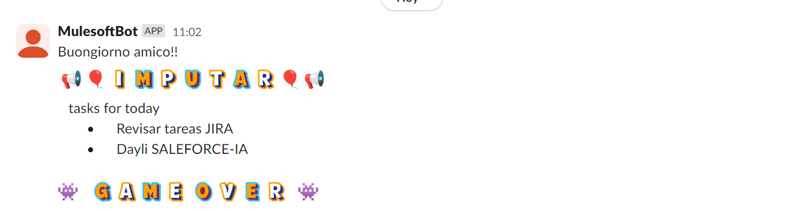
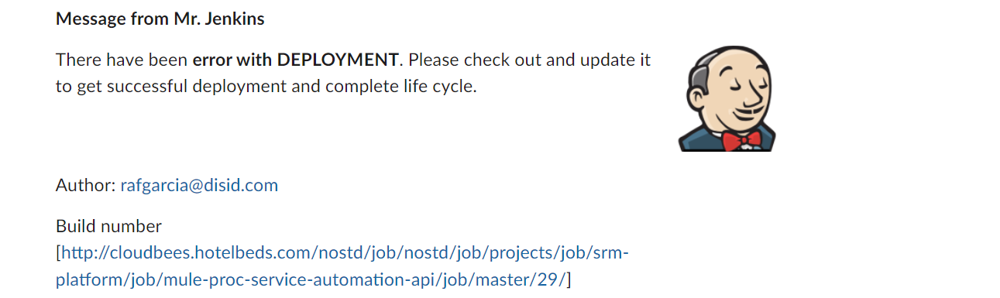
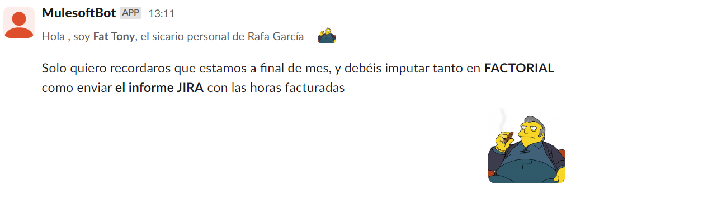

    


# Implementación API con SLACK CONNECTOR para MULESOFT

Descripción de desarrollo api en mulesoft para crear canales y mandar mensajes con el conector de SLACK


## Rafa García

- [@rafagarcia](https://www.linkedin.com/in/rafael-garc%C3%ADa-riva-2ab96711b/)


## Documentation

 - [Tutorial slack api](https://api.slack.com/tutorials)
 
 - [Métodos del propio api](https://api.slack.com/methods)
 
 - [Documentación SLACK connector en MULESOFT](https://docs.mulesoft.com/slack-connector/latest/)
 
 - [Configuración SLACK connector] (https://docs.mulesoft.com/slack-connector/latest/slack-connector-studio)
 


## Usage/Examples

- [Examples SLACK CONNECTOR] (https://docs.mulesoft.com/slack-connector/latest/slack-connector-examples)

- Ejemplo 1. send message
     
    ```
       body:
        {
            "channel" : "brainstorming",
            "text" : "Buongiorno amico!! \n  \n :loudspeaker: :balloon: :alphabet-white-i: :alphabet-yellow-m: :alphabet-white-p: :alphabet-yellow-u: :alphabet-white-t: :alphabet-yellow-a: :alphabet-white-r: :balloon: :loudspeaker: \n\n   tasks for today\n        \u2022      Revisar tareas JIRA\n        \u2022      Dayli SALEFORCE-IA\n\n\n:space_invader:    :alphabet-yellow-g: :alphabet-white-a: :alphabet-yellow-m: :alphabet-white-e:  :alphabet-yellow-o: :alphabet-white-v: :alphabet-yellow-e: :alphabet-white-r:   :space_invader:"
        }     

    ```
    El resultado será el siguiente screenshot:

   <p>
    
   </p>
    (Image 1)
    
- Ejemplo 2. send message
  ```
     body: 
     {
    "channel": "brainstorming",
    "blocks": [
        {
            "type": "section",
            "text": {
                "type": "mrkdwn",
                "text": "*Message from Mr. Jenkins*"
            }
        },
        {
            "type": "section",
            "text": {
                "type": "mrkdwn",
                "text": "There have been *error with DEPLOYMENT*. Please check out and update it to get successful deployment and complete life cycle."
            },
            "accessory": {
                "type": "image",
                "image_url": "https://www.gravatar.com/avatar/c61b120bdaedf42832ad4c9e391b3929?s=120&r=g&d=404",
                "alt_text": "Jenkins image"
            }
        },
        {
            "type": "section",
            "text": {
                "type": "mrkdwn",
                "text": "Author: rafgarcia@disid.com"
            }
        },
        {
            "type": "section",
            "text": {
                "type": "mrkdwn",
                "text": "Build number \n[http://cloudbees.hotelbeds.com/nostd/job/nostd/job/projects/job/srm-platform/job/mule-proc-service-automation-api/job/master/29/]"
            }
        }
    ]
  }

  ```
  El resultado será el siguiente screenshot:

   <p>
     
   </p>
  
    (Image 2)
- Ejemplo 3. send message
  ```
     body:
       {
            "channel": "brainstorming",
            "icon_url": "https://www.giantbomb.com/a/uploads/scale_small/0/9493/2498767-fat-tony-3.png",
            "username": "",
            "blocks": [
            {
                "type": "context",
                "elements": [
                    {
                        "type": "mrkdwn",
                        "text": "Hola , soy *Fat Tony*, el sicario personal de Rafa García"
                    },
                    {
                        "type": "image",
                        "image_url": "https://www.giantbomb.com/a/uploads/scale_small/0/9493/2498767-fat-tony-3.png",
                        "alt_text": "Fat Tony"
                    }
                ]
            },
            {
                "type": "section",
                "text": {
                    "type": "mrkdwn",
                    "text": "Solo quiero recordaros que estamos a final de mes, y debéis imputar tanto en *FACTORIAL* como enviar *el informe JIRA* con las horas facturadas"
                }
            },
            {
                "type": "section",
                "text": {
                    "type": "mrkdwn",
                    "text": "\n"
                },
                "accessory": {
                    "type": "image",
                    "image_url": "https://www.giantbomb.com/a/uploads/scale_small/0/9493/2498767-fat-tony-3.png",
                    "alt_text": "Fat Tony"
                }
            }
        ]
    }
  ```
  El resultado será el siguiente screenshot:

   <p>
     
   </p>
  (Image 3 above these lines)

# mulesoft-slack-connector
